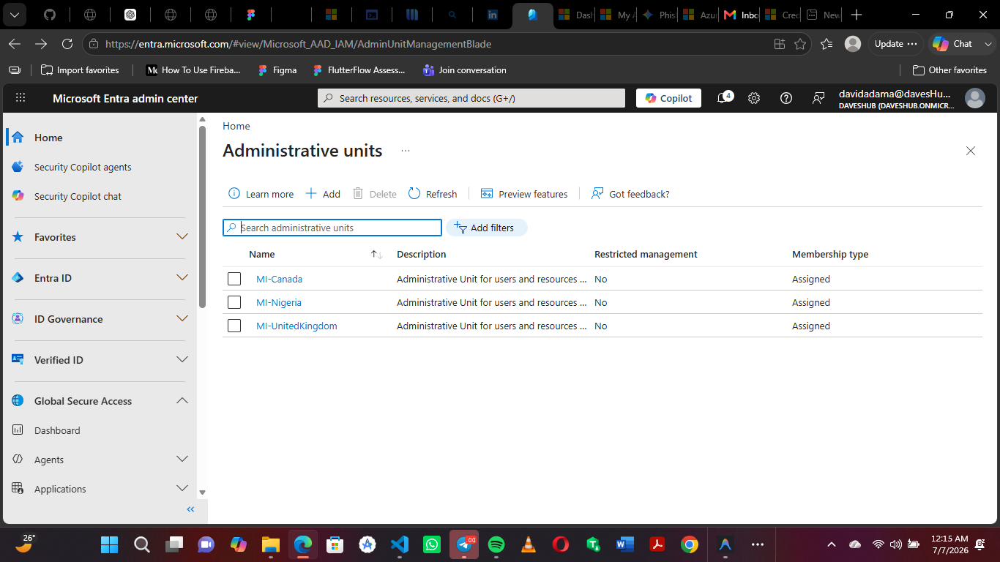

# Administrative Units

> **Project:** Enterprise Identity & Access Management  
> **Module:** 02 – Entra ID Administration  
> **Document:** Administrative Units  
> **Client:** Mustard Innovations  
> **Consultant:** David Adama  
> **Version:** 1.0  
> **Status:** Implemented

---

## Objective

Implement Administrative Units to support delegated administration based on geographic location.

---

## Administrative Units Created

| Administrative Unit | Purpose |
|---------------------|---------|
| MI-Nigeria | Administrative management for users located in Nigeria |
| MI-UnitedKingdom | Administrative management for users located in the United Kingdom |
| MI-Canada | Administrative management for users located in Canada |

---

## Design Rationale

Administrative Units are organized by geographic location to support:

- Delegated administration
- Regional compliance requirements
- Scalable identity management
- Organizational growth through acquisitions

Departmental access will be managed separately using Security Groups, ensuring a clear separation between administrative boundaries and authorization.

---

## Implementation Status

✅ Administrative Units successfully created.

---

## Evidence

