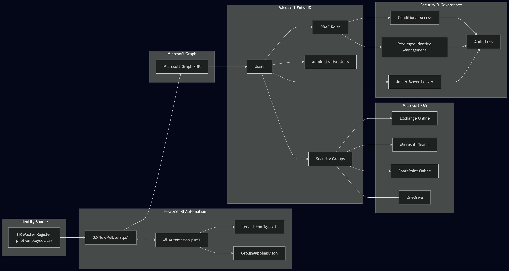
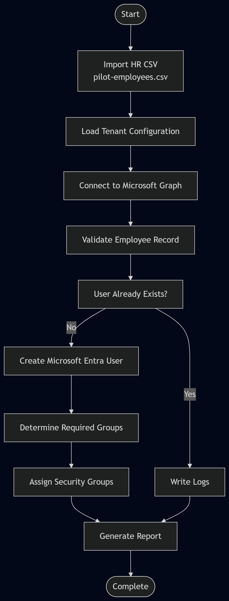

# 01-Enterprise-Cloud-IAM

## Project Summary

This project represents a completed, end-to-end enterprise identity and access management implementation for the Mustard Innovations cloud environment. It brings together identity design, governance, automation, documentation, and validation into one practical portfolio-ready solution.

I completed this work with a strong focus on real-world IAM practices, demonstrating how Microsoft Entra ID and Microsoft 365 can be used to support secure onboarding, role-based access, lifecycle management, and operational automation.

This folder is not just a theoretical exercise. It reflects a structured, hands-on approach to building enterprise-ready identity solutions that are documented, explainable, and relevant to hiring managers, recruiters, and technical reviewers.

## 📈 Project Progress

### ✅ Sprint 1 – Enterprise Foundation

- [x] Tenant Assessment
- [x] Enterprise Identity Standards
- [x] Administrative Units
- [x] Security Groups
- [x] HR Master Register
- [x] Pilot Provisioning Plan

---

### ✅ Sprint 2 – Automation Foundation

- [x] PowerShell 7 Setup
- [x] Microsoft Graph SDK Authentication
- [x] Configuration Management
- [x] Reusable Automation Module
- [x] Identity Generation Engine
- [x] User Provisioning Engine
- [x] Preview Mode
- [x] Live Mode
- [x] Logging
- [x] Reporting
- [x] Metrics Dashboard

---

### 🔄 Current Sprint

**Sprint 2 – Story 2**

**Current Task**

Provision and validate the first pilot user before scaling to all 10 pilot users.

---

### 🎯 Upcoming Milestones

- Provision first pilot user
- Validate user attributes
- Assign Security Groups
- Assign Administrative Units
- Automate Group Membership
- Automate Manager Assignment
- Implement Joiner-Mover-Leaver (JML) workflow

---

## What Was Built

This project covers the full identity journey from planning through implementation:

- Enterprise identity design and organization structure
- Naming standards and administrative role planning
- User provisioning and lifecycle management concepts
- Automation of provisioning workflows using PowerShell and Microsoft Graph
- Governance-oriented documentation and implementation evidence
- Security-focused IAM design principles and operational readiness

The most important part of this project is that it combines technical implementation with clear documentation, making it easy to understand both the solution and the reasoning behind it.

---

## Why This Project Stands Out

This work demonstrates several strengths that are valuable in professional security and IAM roles:

- Practical understanding of Microsoft Entra ID and Microsoft 365 identity concepts
- Ability to translate business requirements into structured IAM design
- Experience with automation and repeatable provisioning workflows
- Strong documentation discipline and evidence-based delivery
- Awareness of governance, security, and operational best practices

For hiring managers, this project shows that the work was approached with an enterprise mindset rather than as a simple lab exercise.

For recruiters, it provides a clear story around identity engineering, automation, and cloud security readiness.

---

## Key Areas of Focus

### 1. Identity Architecture
The project includes structured documentation for:

- Organization structure
- Naming standards
- Administrative roles
- Licensing strategy
- Identity lifecycle planning
- Security principles

### 2. User Provisioning Automation
The automation components show how employee data can be converted into identity provisioning workflows, including:

- HR-driven input handling
- User attribute generation
- Provisioning automation
- Result tracking and reporting

### 3. Governance and Security Design
The folder also includes deliverables that reflect governance maturity and enterprise security thinking, including:

- Security group planning
- Administrative unit design
- RBAC-aligned structure
- Privileged access considerations
- Governance documentation

### 4. Documentation and Evidence
A major strength of this project is the documentation trail. Every implementation area is supported by clear explanations, structure, and supporting artifacts.

---

## Project Highlights

The most notable parts of this project are:

- A complete IAM-focused lab structure that is easy to review
- Clear evidence of practical implementation work
- A balance of technical depth and business context
- Strong alignment with enterprise identity and access management practices
- A portfolio-ready presentation of cloud security and IAM knowledge

---

## Folder Structure

The main areas of the project are organized as follows:

- [automation/](automation/) - Provisioning scripts, modules, configuration, and operational assets
- [documentation/](documentation/) - Design, governance, lifecycle, and identity strategy documents
- [HR/](HR/) - Employee source data and lifecycle-related files
- [modules/](modules/) - Implementation deliverables and structured evidence
- [policies/](policies/) - Policy and governance-related assets
- [powershell/](powershell/) - PowerShell utilities and provisioning scripts
- [scripts/](scripts/) - Supporting scripts and utilities
- [terraform/](terraform/) - Infrastructure-as-code examples
- [diagrams/](diagrams/) - Architecture and design visuals
- [screenshots/](screenshots/) - Evidence and implementation screenshots

---

## Architecture Diagrams
The project includes several architecture and workflow visuals under `diagrams/exports/`.

---

## Recommended Review Path

For a quick but meaningful review, I recommend reading in this order:

1. [documentation/README.md](documentation/README.md)
2. [documentation/identity-design.md](documentation/identity-design.md)
3. [documentation/identity-lifecycle.md](documentation/identity-lifecycle.md)
4. [automation/](automation/)
5. [automation/powershell/](automation/powershell/)
6. [automation/modules/](automation/modules/)

---

## Hiring Manager and Recruiter Perspective

From a hiring perspective, this project demonstrates that I can:

- Translate business identity needs into technical solutions
- Build repeatable automation instead of relying on manual processes
- Approach security-sensitive work with structure and discipline
- Deliver documentation that supports auditability and operational readiness
- Move confidently across planning, implementation, and validation phases

From a recruiting perspective, this project is well suited for roles such as:

- Cloud Identity Engineer
- Microsoft 365 / Entra ID Engineer
- IAM Engineer
- Security Automation Engineer
- Cloud Operations Engineer

---

## Key Artifacts to Review

Some of the most relevant files and folders include:

- [automation/modules/MI.Automation.psm1](automation/modules/MI.Automation.psm1)
- [automation/powershell/02-New-MIUsers.ps1](automation/powershell/02-New-MIUsers.ps1)
- [documentation/identity-design.md](documentation/identity-design.md)
- [documentation/identity-lifecycle.md](documentation/identity-lifecycle.md)
- [documentation/administrative-roles.md](documentation/administrative-roles.md)
- [documentation/security-principles.md](documentation/security-principles.md)
- [modules/02-Entra-ID-Administration/](modules/02-Entra-ID-Administration/)

---

## Technical Stack

The implementation reflects a modern enterprise security and IAM toolset, including:

- Microsoft Entra ID
- Microsoft 365
- Microsoft Graph PowerShell SDK
- PowerShell automation
- Terraform
- CSV-based provisioning workflows
- Structured documentation and evidence-based delivery

---

## Closing Note

This folder represents a completed and portfolio-ready example of applied cloud identity work. It shows not only technical capability, but also the discipline, clarity, and professional approach expected in enterprise IAM and cloud security environments.
