# Enterprise Identity Platform

<p align="center">
  
</p>

<p align="center">
  
  
  
  
  
</p>

## Table of Contents

- [Project Overview](#project-overview)
- [Why this matters](#why-this-matters)
- [Architecture Snapshot](#architecture-snapshot)
- [Project Highlights](#project-highlights)
- [Business Context](#business-context)
- [Business Impact](#business-impact)
- [Project Scope](#project-scope)
- [Getting Started](#getting-started)
- [Workflow Documentation](#workflow-documentation)
- [Validation & Testing](#validation--testing)
- [Completion Summary](#completion-summary)
- [Recruiter Snapshot](#recruiter-snapshot)
- [Objectives](#objectives)
- [Technology Stack](#technology-stack)
- [Repository Structure](#repository-structure)
- [Current Project Status](#current-project-status)
- [Identity Lifecycle Workflows](#identity-lifecycle-workflows)

## Getting Started

### Prerequisites

- PowerShell 7
- Microsoft Graph PowerShell SDK
- Access to a Microsoft Entra ID tenant
- HR CSV data in `HR\source`
- JSON configuration files in `automation\configuration`

### Run the workflows

From the `01-Enterprise-Identity-Platform` folder:

```powershell
cd "C:\Users\Dave\Documents\Cloud-Security-Projects\01-Enterprise-Identity-Platform"
cd automation\powershell
.\10-Invoke-MIJoiner.ps1 -Limit 5
.\11-Move-MIEmployees.ps1 -Live -Limit 5
.\13-Leaver-MIEmployees.ps1 -Live -Limit 5
```

Use `-Live` to apply changes and omit `-Live` to run in preview mode.

## Workflow Documentation

The project includes workflow-specific documentation for each orchestration type:

- [Joiner orchestration](./automation/powershell/README-Joiner.md)
- [Mover orchestration](./automation/powershell/README-Mover.md)
- [Leaver orchestration](./automation/powershell/README-Leaver.md)

## Validation & Testing

The automation has been tested in both preview and live modes. Key validation checkpoints include:

- HR data validation
- Desired-state model generation
- Execution plan creation
- Preview execution without side effects
- Live execution with Microsoft Graph changes
- Report generation and structured logging

## Completion Summary

This project is complete as a portfolio-grade reference implementation for enterprise identity lifecycle automation. It demonstrates:

- Joiner, Mover, and Leaver orchestration
- Microsoft Graph-based identity operations
- Modular PowerShell automation
- Privileged access and RBAC controls
- Audit-ready logging and reporting

---

## Project Overview

> 🔐 Identity Security Automation for the full Joiner–Mover–Leaver lifecycle

This platform demonstrates the design, automation, and operational execution of an enterprise-grade identity lifecycle environment built around Microsoft Entra ID, Microsoft Graph, and PowerShell-based orchestration.

It supports the full **Joiner – Mover – Leaver (JML)** lifecycle and reflects a realistic enterprise identity model for employee lifecycle management, security group handling, RBAC, license control, manager assignment, and administrative unit reconciliation.

### At a Glance

- 🔑 Automated onboarding and offboarding
- 🧠 Desired-state vs current-state reconciliation
- 🛡️ Privileged access protection and fail-closed handling
- 📊 Operational reporting and lifecycle evidence
- ⚙️ Modular PowerShell orchestration for enterprise IAM

### Why this matters

This project addresses a common enterprise problem: identity operations are repetitive, high-risk, and often inconsistent when managed manually. By automating the Joiner, Mover, and Leaver lifecycle through Microsoft Graph and PowerShell, the platform reduces administrative overhead, strengthens access hygiene, and creates auditable execution evidence.

### Architecture Snapshot

```text
HR Feed / CSV --> Validation --> Identity State Discovery --> Desired State Model
          |                                              |
          v                                              v
   Joiner / Mover / Leaver Orchestration --> Execution Planning --> Live or Preview Run
          |                                              |
          v                                              v
Microsoft Graph API --> Entra ID Users / Groups / Roles / Licenses / Units --> Logs & Reports
```

### Architecture & Design Views

<p align="center">
  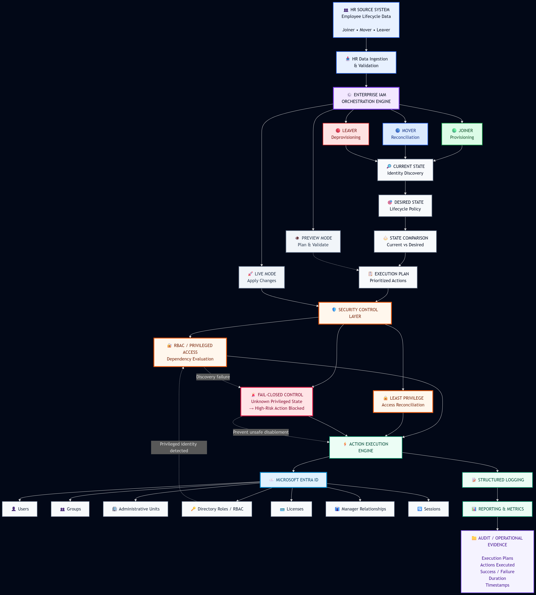
</p>

<p align="center">
  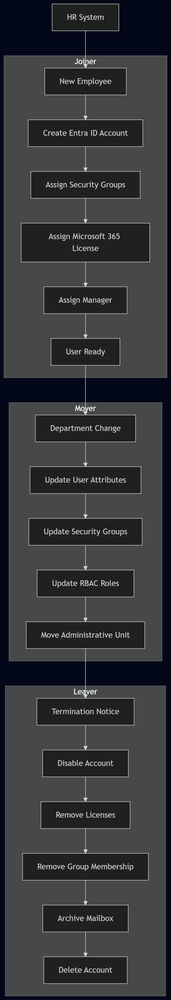
</p>

<p align="center">
  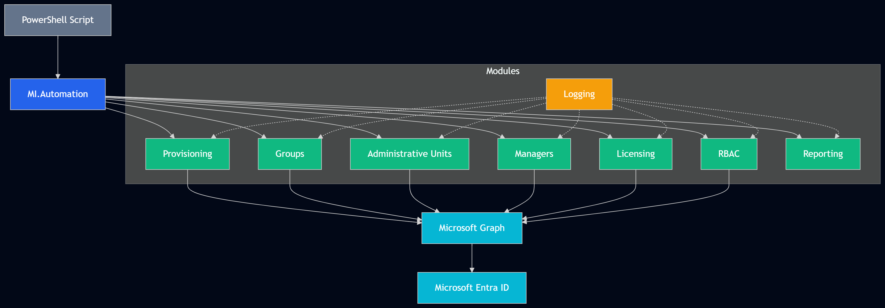
</p>

<p align="center">
  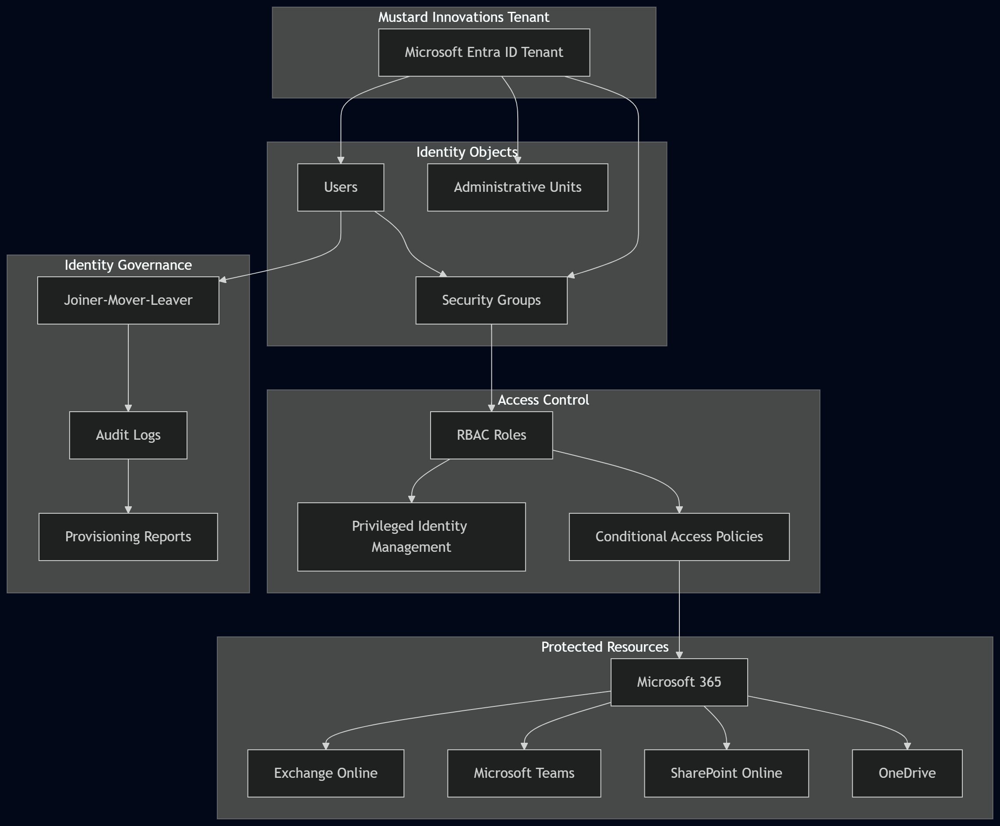
</p>

<p align="center">
  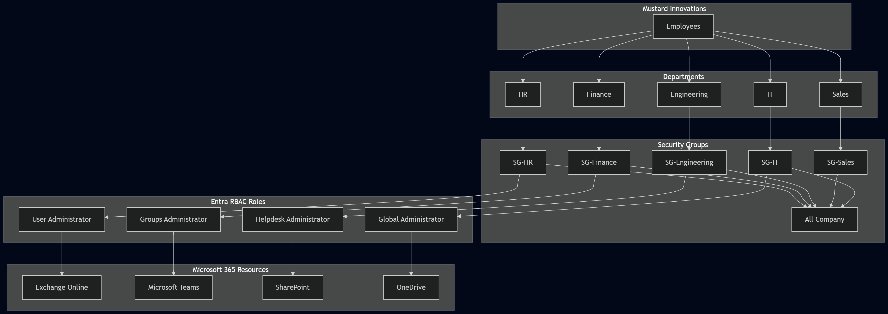
</p>

<p align="center">
  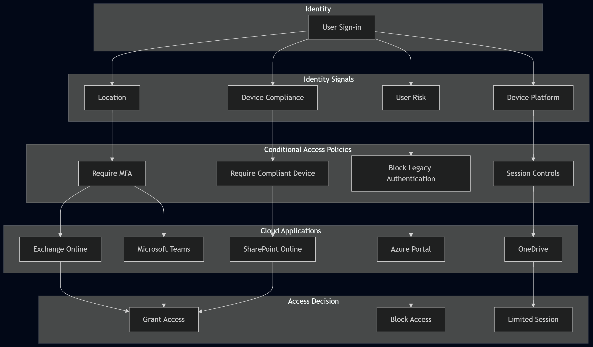
</p>

<p align="center">
  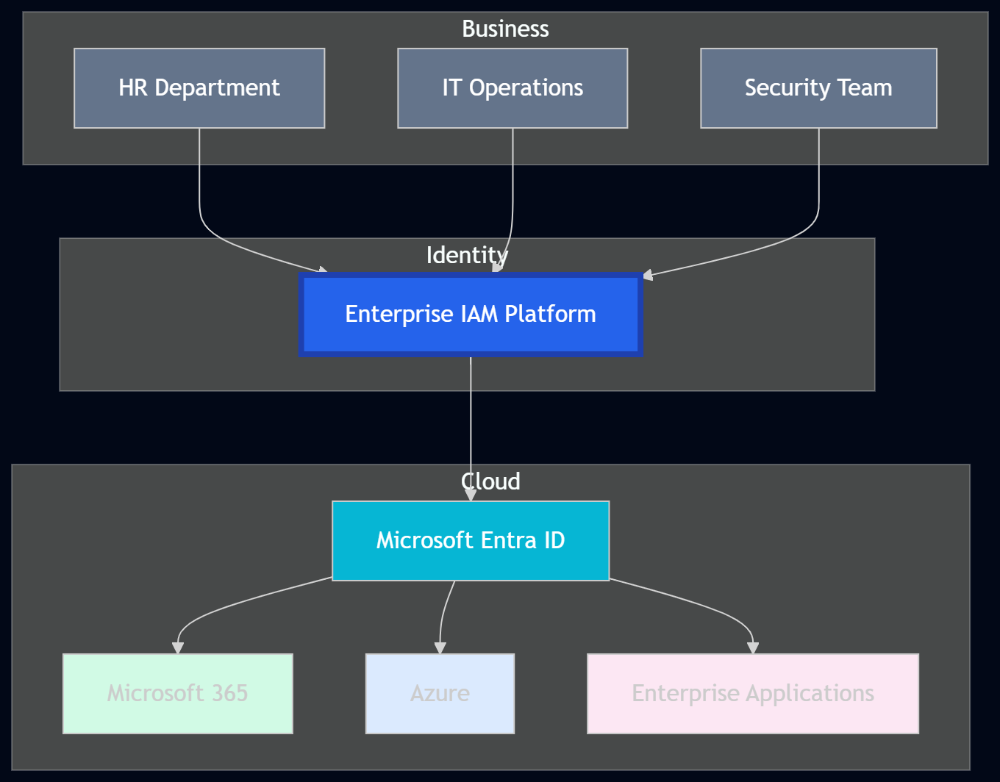
</p>

<p align="center">
  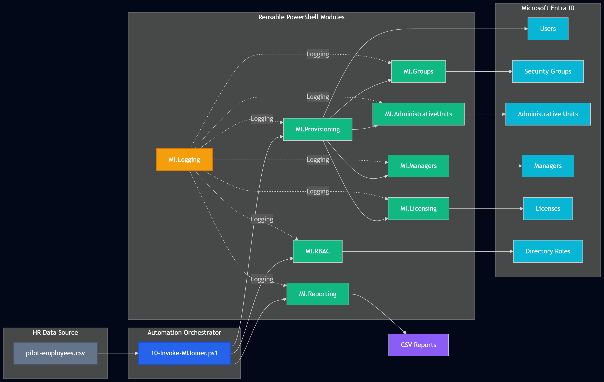
</p>

### Project Highlights

| Area | Value Delivered |
|---|---|
| Identity Lifecycle | End-to-end Joiner, Mover, and Leaver orchestration |
| Security Controls | RBAC cleanup, privileged protection, fail-closed handling |
| Automation | Modular PowerShell and Graph-based execution |
| Governance | State reconciliation, reviewability, and reporting |
| Operational Value | Reduced manual admin effort and license leakage |

---

## Business Context

The project simulates a fictional enterprise organization, **Mustard Innovations**, and implements identity processes that align with production expectations for:

- HR-driven provisioning
- Identity state comparisons
- Lifecycle automation
- Preview vs live execution
- Access reconciliation
- Security controls and RBAC governance
- Reporting and operational logging

---

## Business Impact

The platform is designed to reduce the operational cost, security exposure, and administrative overhead associated with employee identity lifecycle management.

For the fictional Mustard Innovations environment, the business case is modelled against a hypothetical enterprise with approximately **1,000 employees** and a continuously changing workforce.

The financial figures below are **illustrative estimates used to demonstrate potential enterprise impact**, rather than measured production savings.

### Estimated Annual Impact

| Business Area | Estimated Annual Impact |
|---|---:|
| Joiner provisioning automation | $20,000 – $35,000 |
| Mover lifecycle automation | $15,000 – $30,000 |
| Leaver/offboarding automation | $20,000 – $40,000 |
| Reduced manual access administration | $15,000 – $25,000 |
| Reduced excessive-license exposure | $10,000 – $25,000 |
| Reduced security and compliance exposure | $25,000 – $75,000+ |
| **Potential annual impact** | **$105,000 – $230,000+** |

These estimates represent potential operational savings, avoided access-management costs, license optimization, and reduced security/compliance exposure.

### Operational Efficiency

Without lifecycle automation, identity operations can require manual coordination between HR, IT, security, and application owners.

The platform automates repetitive activities such as:

- User provisioning
- Group assignment
- License assignment and removal
- Manager assignment
- Administrative Unit reconciliation
- RBAC assignment and removal
- Session revocation
- Employee offboarding
- Identity state validation
- Execution reporting

This can reduce the number of manual identity administration tasks performed by IT and security teams.

### Example Productivity Model

Assuming:

- 1,000 employees
- 20% annual employee movement
- 200 lifecycle events per year
- 30–60 minutes of manual identity administration per event
- Average operational labour cost of $40/hour

Manual lifecycle administration could represent approximately:

**100–200 hours of administrative effort annually.**

Automating these activities creates capacity that can instead be directed toward security engineering, governance, incident response, and infrastructure operations.

### License Optimization

The platform also provides a foundation for automatically removing licenses when employees leave the organization.

For example, if 100 employees leave during a year and each retains an unused $20/month license for three months:

**100 × $20 × 3 = $6,000**

of avoidable annual license expenditure.

Automated lifecycle processing can reduce this type of license leakage by tying license state to employee lifecycle state.

### Security Risk Reduction

The financial impact is not limited to labour savings.

Delayed deprovisioning can create security exposure when former employees retain:

- Active accounts
- Group memberships
- Directory roles
- Application access
- Active sessions
- Administrative privileges

The Leaver orchestration reduces this exposure by automatically evaluating and executing access-removal actions.

The project also implements **fail-closed behaviour** for privileged identity operations.

During live testing, a privileged identity with an assigned Microsoft Entra directory role encountered an authorization failure when account disablement was attempted.

Rather than treating the RBAC discovery failure as "no roles found," the workflow was designed to prevent unsafe account disablement until privileged access could be evaluated.

This demonstrates how IAM automation can reduce both operational risk and potential security incident exposure.

### Compliance and Auditability

Automated execution produces structured operational evidence including:

- Execution timestamps
- Employee identifiers
- Planned actions
- Executed actions
- Success/failure status
- Execution duration
- Automation logs
- Lifecycle reports

This reduces the effort required to demonstrate that identity lifecycle processes are being consistently executed and provides evidence for internal audits and security reviews.

### Business Value

The platform therefore provides value across four major areas:

**Cost Reduction**

- Reduced manual identity administration
- Reduced unused license expenditure
- Reduced operational overhead

**Security**

- Faster access removal
- Privileged identity protection
- Fail-closed security controls
- Reduced orphaned access

**Operational Efficiency**

- Automated lifecycle execution
- Consistent state reconciliation
- Reduced manual intervention
- Repeatable processes

**Governance**

- Centralized lifecycle logic
- Execution plans
- Logging and reporting
- Audit-oriented evidence


---

## Project Scope

The platform covers the design and implementation of an automated employee identity lifecycle for a Microsoft Entra ID environment.

### In Scope

<p align="center">
  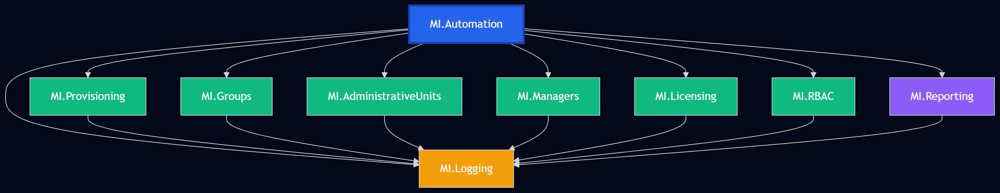
</p>

#### Identity Lifecycle Management

- Joiner orchestration
- Mover orchestration
- Leaver orchestration
- Current identity state discovery
- Desired identity state modelling
- State comparison
- Lifecycle execution planning
- Preview and live execution modes

#### Identity Provisioning

- HR data validation
- Microsoft Entra user creation
- Employee ID synchronization
- Manager assignment
- Department and job-title handling
- Country-based identity organization

#### Access Management

- Security group assignment
- Group reconciliation
- Group removal during offboarding
- Microsoft 365 group handling
- License assignment
- License removal
- Administrative Unit assignment and reconciliation

#### Privileged Access Management

- Microsoft Entra RBAC discovery
- Directory role assignment
- Directory role reconciliation
- Privileged role removal during offboarding
- Dependency-aware action ordering
- Fail-closed behaviour when privileged-access discovery fails

#### Automation Engineering

- Microsoft Graph PowerShell automation
- Reusable PowerShell modules
- CSV-driven HR workflows
- JSON configuration
- Execution planning
- Idempotent state reconciliation
- Preview/live execution separation

#### Operational Management

- Structured logging
- Execution reports
- Execution metrics
- Success/failure tracking
- Post-execution validation
- Audit-oriented evidence
- Portfolio documentation

### Out of Scope

<p align="center">
  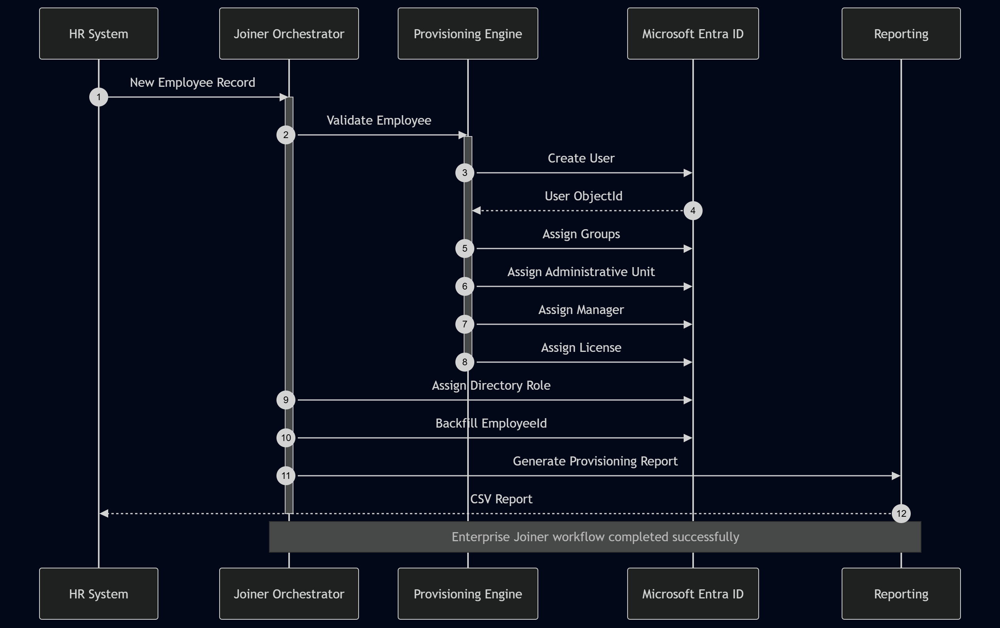
</p>

The current implementation does not attempt to provide a complete enterprise IAM product.

The following areas remain outside the current implementation or are planned extensions:

- Full production HRIS integration
- Real-time event-driven HR integration
- Complete Microsoft Entra PIM activation workflows
- Automated mailbox archival implementation
- Full application entitlement governance
- SaaS application deprovisioning
- Service-account lifecycle management
- Non-human identity governance
- Production secrets-management infrastructure
- Multi-tenant production deployment
- Full ITSM integration
- Production-scale high availability architecture

These areas provide potential future expansion of the platform.


---

## Scale & Enterprise Relevance

Although implemented as a portfolio environment, the platform is designed around patterns applicable to enterprise IAM operations.

The architecture separates:

- HR data ingestion
- Identity state discovery
- Desired-state modelling
- State comparison
- Execution planning
- Action execution
- Logging
- Reporting

This separation allows individual lifecycle operations to be extended without redesigning the entire platform.

The orchestration model can be extended from a small pilot environment to larger employee populations by introducing:

- Event-driven HR integrations
- Queue-based processing
- ITSM integration
- Centralized secrets management
- Azure Automation or CI/CD execution
- Microsoft Entra PIM integration
- Application entitlement reconciliation
- Centralized monitoring
- Enterprise audit pipelines

The current project therefore serves as a **reference implementation of an enterprise IAM orchestration architecture**, rather than simply a collection of PowerShell scripts.

---

## Recruiter Snapshot

| Capability | Demonstrated |
|---|---|
| Identity Lifecycle | Joiner, Mover, Leaver |
| Identity Platform | Microsoft Entra ID |
| Automation | PowerShell 7 + Microsoft Graph |
| Access Governance | Groups, RBAC, Administrative Units, Licenses |
| Security Engineering | Fail-closed privileged identity handling |
| Architecture | State-based orchestration |
| Execution Model | Preview + Live |
| Operations | Logging, reporting, metrics, validation |
| Data Integration | CSV HR source + JSON configuration |
| Engineering Practices | Modular, reusable, idempotent automation |
| Enterprise Thinking | Dependency-aware lifecycle execution |


## Objectives

- Automate employee identity lifecycle management in Microsoft Entra ID
- Implement Joiner, Mover, and Leaver orchestration
- Standardize identity state detection and desired-state comparison
- Automate group, role, license, and manager reconciliation
- Enforce least privilege and fail-closed security behavior
- Generate execution plans before making changes
- Support both preview and live execution modes
- Produce logs, reports, and operational evidence

---

## Technology Stack

- Microsoft Entra ID
- Microsoft Graph PowerShell SDK
- Microsoft Graph API
- PowerShell 7
- CSV HR data feeds
- JSON configuration files
- Git and GitHub

---

## Repository Structure

```text
01-Enterprise-Identity-Platform/
├── automation/
│   ├── configuration/
│   ├── constants/
│   ├── graph/
│   ├── logs/
│   ├── modules/
│   ├── powershell/
│   ├── reports/
│   └── terraform/
├── diagrams/
│   ├── exports/
│   └── source/
├── documentation/
│   ├── architecture/
│   ├── implementation/
│   ├── legacy/
│   └── operations/
├── HR/
│   ├── archive/
│   ├── employees/
│   ├── managers/
│   ├── offboarding/
│   ├── onboarding/
│   ├── processed/
│   ├── source/
│   └── templates/
├── modules/
│   ├── 01-Project-Foundation/
│   ├── 02-Identity-Provisioning/
│   ├── 03-Authentication-and-Identity-Protection/
│   ├── 04-RBAC/
│   ├── 05-Conditional-Access/
│   ├── 06-Identity-Governance/
│   ├── 07-Privileged-Identity-Management/
│   └── 10-Capstone/
├── policies/
├── reports/
├── screenshots/
│   ├── dynamic-groups/
│   ├── licenses/
│   ├── managers/
│   ├── provisioning/
│   └── rbac/
├── README.md
└── ...
```

---

## Current Project Status

| Area | Status |
|---|---|
| Foundation | ✅ Complete |
| HR Validation | ✅ Complete |
| Provisioning | ✅ Complete |
| License Assignment | ✅ Complete |
| Dynamic Groups | ✅ Complete |
| RBAC Assignment | ✅ Complete |
| Manager Assignment | ✅ Complete |
| Administrative Units | ✅ Complete |
| Joiner Lifecycle | ✅ Complete |
| Mover Lifecycle | ✅ Complete |
| Leaver Lifecycle | ✅ Complete |
| Security Hardening | ✅ Core Controls Complete |

---

## Identity Lifecycle Workflows

### Joiner workflow

The Joiner workflow automates employee onboarding and provisioning into Microsoft Entra ID.

Typical actions include:

- HR validation
- User creation
- Group assignment
- License assignment
- Manager assignment
- Administrative Unit assignment
- RBAC assignment
- Reporting and validation

#### Joiner execution gallery (12 images)

.png)

.png)

.png)

.png)

.png)

.png)

.png)

.png)

.png)

.png)

.png)

.png)

---

### Mover workflow

The Mover workflow compares the employee's current state with the desired state and reconciles identity attributes, admin unit placement, group membership, role assignment, and manager updates.

Typical actions include:

- Department and role changes
- Manager updates
- Group reconciliation
- Administrative unit movement
- RBAC updates
- Reporting and validation

<p align="center">
  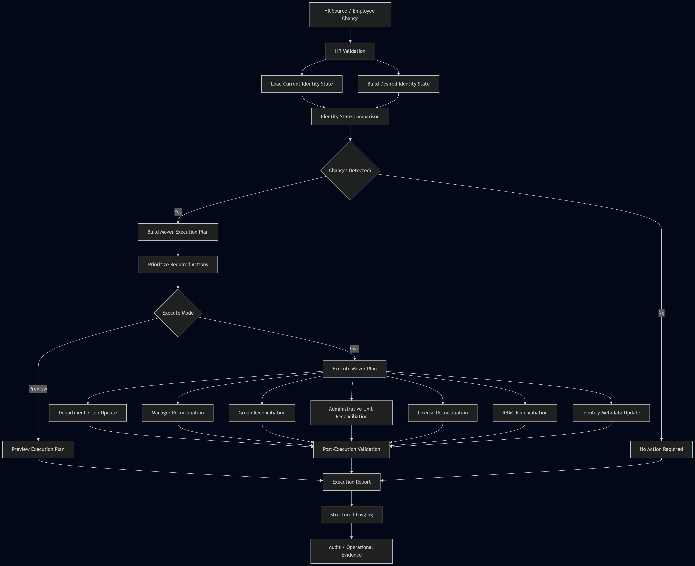
</p>

#### Mover execution gallery (12 images)

.png)

.png)

.png)

.png)

.png)

.png)

.png)

.png)

.png)

.png)

.png)

.png)

---

### Leaver workflow

The Leaver workflow evaluates the employee's current identity state against the desired terminated state and generates a prioritized execution plan.

For privileged identities, the workflow prioritizes RBAC cleanup before account disablement to avoid authorization conflicts and unsafe assumptions about privileged access.

Typical actions include:

- RBAC cleanup
- Account disablement
- Session revocation
- Group removal
- License removal
- Manager clearing
- Administrative Unit reconciliation
- Mailbox archival handling
- Reporting and audit trail

<p align="center">
  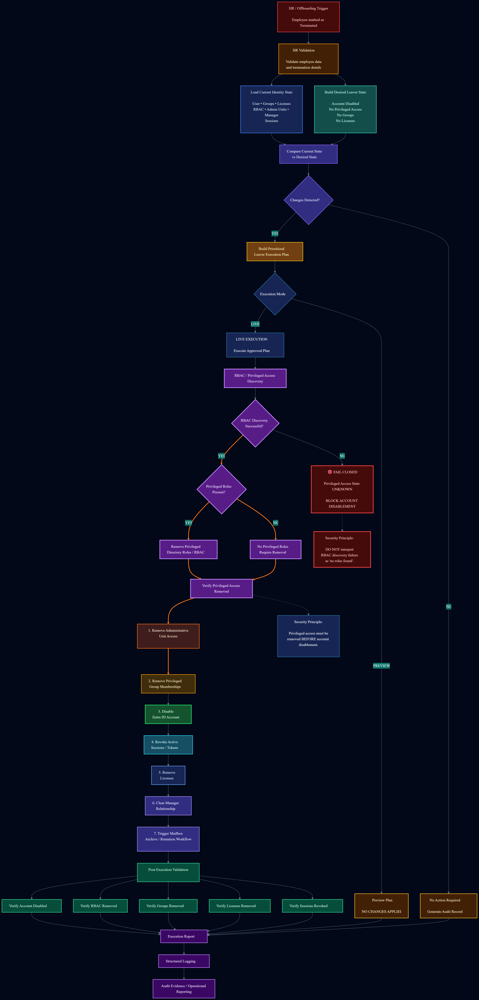
</p>

#### Leaver execution gallery (15 images)

.png)

.png)

.png)

.png)

.png)

.png)

.png)

.png)

.png)

.png)

.png)

.png)

.png)

.png)

.png)

---

## Automation Modules

| Module | Purpose |
|---|---|
| MI.Provisioning | Employee provisioning |
| MI.Groups | Group assignment and cleanup |
| MI.Managers | Manager reconciliation |
| MI.AdministrativeUnits | Administrative unit assignment |
| MI.Licensing | License assignment and removal |
| MI.RBAC_Automation | Role assignment reconciliation |
| MI.Reporting | Execution reporting |
| MI.Logging | Logging and operational traceability |

---

## Security Considerations

The platform includes security-first controls designed to reflect enterprise IAM operating principles.

---

## Engineering Highlights

### Identity Lifecycle Engineering

- Joiner, Mover, and Leaver orchestration
- Current-state identity discovery
- Desired-state modelling
- State comparison
- Execution-plan generation
- Prioritized lifecycle actions
- Access reconciliation

### Security Engineering

<p align="center">
  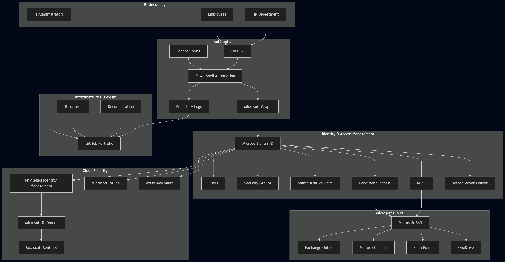
</p>

- Microsoft Entra RBAC lifecycle management
- Privileged identity handling
- Least-privilege principles
- Fail-closed security controls
- Authorization failure handling
- Dependency-aware execution ordering
- Privileged access removal before account disablement

### Automation Engineering

- PowerShell 7 automation
- Microsoft Graph PowerShell SDK
- Modular PowerShell architecture
- Reusable orchestration functions
- CSV-driven HR lifecycle processing
- Preview and live execution modes
- State-based reconciliation

### Operational Engineering

- Structured logging
- Execution reports
- Execution metrics
- Post-execution validation
- Failure tracking
- Audit-oriented execution evidence

### Privileged Identity Protection

During live Leaver testing, the orchestration engine encountered a privileged identity that retained a Microsoft Entra directory role.

The account-disable operation returned:

403 Authorization_RequestDenied

The issue was traced to the employee retaining a Microsoft Entra directory role assignment.

After the privileged role assignment was removed, the account-disable operation succeeded.

This exposed an important lifecycle dependency:

> **Privileged access must be removed before disabling a privileged identity.**

### Fail-Closed Behavior

The Leaver orchestration engine does not interpret failed RBAC discovery as evidence that no privileged roles exist.

When RBAC discovery fails:

1. The engine determines whether the account requires disablement.
2. RBAC discovery is attempted.
3. If RBAC discovery succeeds, privileged assignments are evaluated.
4. Privileged RBAC assignments are removed before account disablement.
5. If RBAC discovery fails, account disablement is blocked.
6. Independent lifecycle actions can continue to be evaluated separately.
7. The failure is recorded for operational investigation.

This prevents the automation engine from making an unsafe assumption about privileged access.

### Security Controls

The platform implements:

- Least-privilege principles
- RBAC lifecycle management
- Privileged identity handling
- Fail-closed security behavior
- Authorization failure handling
- Dependency-aware execution ordering
- Preview execution before live changes
- Desired-state vs current-state comparison
- Controlled action prioritization
- Session revocation
- Group and license reconciliation
- Administrative Unit reconciliation
- Operational logging
- Execution reporting
- Post-execution validation
---

## Executive Summary

This project reflects a realistic enterprise identity and access automation implementation using Microsoft Entra ID and PowerShell. It demonstrates the practical application of identity lifecycle management, governance, operational control, and enterprise-grade automation.

The solution is designed to show not only the technical implementation, but also the operational and security reasoning behind working with identity lifecycle workflows in a production-style environment.

---

## Final Project Status

**Status: ✅ Complete**

The Enterprise Identity Platform has been implemented and validated as an
end-to-end Microsoft Entra identity lifecycle automation platform.

The completed implementation demonstrates:

- Joiner orchestration
- Mover orchestration
- Leaver orchestration
- Identity state discovery
- Desired-state modelling
- State reconciliation
- RBAC lifecycle management
- Group lifecycle management
- Administrative Unit reconciliation
- License lifecycle management
- Manager reconciliation
- Preview and live execution
- Fail-closed security controls
- Dependency-aware execution ordering
- Structured logging
- Execution reporting
- Post-execution validation

A privileged identity authorization edge case discovered during live testing
was used to improve the Leaver orchestration design and introduce
fail-closed behavior for privileged-access uncertainty.

SCIM provisioning, SaaS federation, application lifecycle management,
and broader multi-cloud identity capabilities are intentionally outside
the scope of this project and are addressed in subsequent portfolio work.